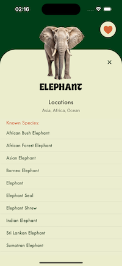
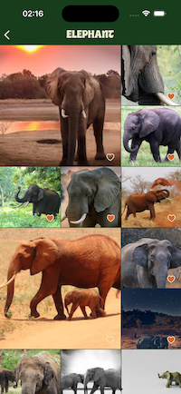
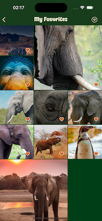
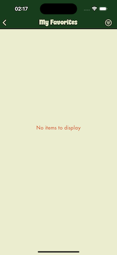

# Animal Browser

## Project Overview

The Animal Browser app allows users to browse images of animals from Pexels.com and view details about different animal species and their known locations from the API-Ninja. Users can mark their favorite photos, view a list of favorited photos, and filter favorited photos by animal species.

## Prerequisites

Before running the Animal Browser project, ensure that you have the following:

1. **API Keys:**
    - Pexels API Key: Obtain your API key from Pexels by registering on their website [https://www.pexels.com/api/](https://www.pexels.com/api/).
    - API-Ninja Key: Get an API key from API-Ninja by signing up [https://api-ninja.com/](https://api-ninja.com/).

2. **Swift 5:**
    - Ensure that you have Swift 5 installed on your development environment.

3. **Xcode:**
    - The project is built using Xcode. Make sure you have the latest version installed.

4. **CocoaPods:**
    - Install CocoaPods if not already installed. You can install it using the following command:
      ```bash
      sudo gem install cocoapods
      ```

## Getting Started

1. **Clone the repository:**
    ```bash
    git clone https://github.com/your-username/animal-browser.git
    cd animal-browser
    ```

2. **Install dependencies using CocoaPods:**
    ```bash
    pod install
    ```

3. **Open the `AnimalBrowser.xcworkspace` file in Xcode.**

4. **Replace the placeholders for API keys in the project:**
    - Open `APIHandler/APIs.swift` and replace `PEXELS_KEY` with your Pexels API key.
    - Next, in the same file replace `API_NINJA_KEY` with your API-Ninja API key.

5. **Build and run the project in Xcode.**

## App Structure

### Main Page
- Displays a list of animals, known species, and known locations.
- There is `Show More` button to give known species list of selected animal.
- User can navigate and browse animal photos by clicking the picture.
- Favorite button in the top-right corner to navigate to the Favorites page.

### Second Page - Photo List
- Shows a list of animal photos from Pexels.com based on selected animal species from Main Page.
- By clicking a photo from the list, app will open a Pop-up view to give bigger picture and some natigation for user.
- Users can view detailed information about each photo, including the photographer's name and open browser to directly view the original photo in Pexels.com.
- Users can option to like/unlike photos and mark them as favorites by clicking the `Add To My Favorite` button.
- User also can navigate into Favorite page by clicking `Show My Favorites` button from the Pop-up view.

### Third Page - Favorited Photos
- Displays list of user's favorited photos.
- By clicking a photo from the list, app will open a Pop-up view to give bigger picture and some natigation for user.
- Users can view detailed information about each photo, including the photographer's name and open browser to directly view the original photo in Pexels.com.
- Users can option to like/unlike photos and mark them as favorites by clicking the `Add To My Favorite` button.
- Users can filter favorited photos by animal species using the filter button in the navigation bar.


## Screenshots











## Technologies Used
- Swift 5
- UIKit
- CoreData

## Acknowledgments
- Pexels API for animal photos: [https://www.pexels.com/api/](https://www.pexels.com/api/)
- API-Ninja for animal details: [https://api-ninja.com/](https://api-ninja.com/)

## License
This project is licensed under the GNU General Public License v3.0 - see the [LICENSE](LICENSE) file for details.
